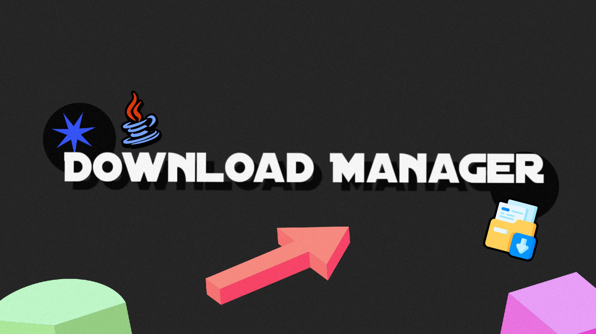

# Download Manager
download manager makes you download anything did you want,  
videos files images and more

## Requirements
to run this program you need  
- java development kit 17 (JDK 17)

## Support 
this project support all operating systems  
- Windows  
- Linux  
- Mac

## Features
- Parallel Download (split the download into several parts to improve performance and increase download speed)
- Download Manager determines the download speed according to your device's capabilities like buffer size
- Download Manager log all success and failure downloads in [log.csv]
- Different type of progress bar that download manager provide like default & rainbow & arrow
- Download task priorities (coming soon)
- Multi Downloads tasks (coming soon)


## Usage
```
java -jar DownloadManager.jar -d <URL>
```
for reading logs 
```
java -jar DownloadManager.jar --logs
```
check program version
```
java -jar DownloadManager.jar --version
```
modify configuration file
```
java -jar DownloadManager.jar --config <property> <new Value>
```

## Version
- 1.0-alpha

## Deprecated
```
resumeFaliureDownload(): overrided method in ParallelDownloadManager
```

## Licence
[MIT LICENCE](LICENCE)

## Authors
- habbashx